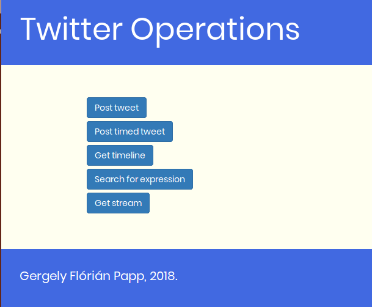
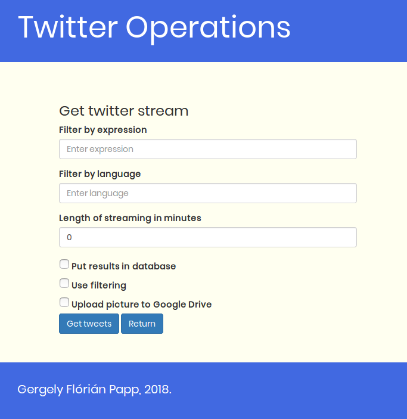
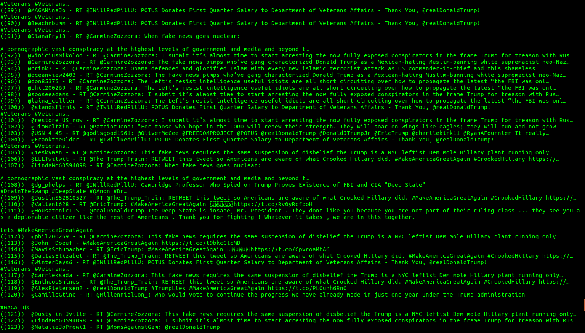

# Twitter Operations
A Java program implementing the Twitter API. It has the following features:
* The ability to post a normal or a timed tweet.
* To get the desired parts of a user's timeline.
* Getting tweets that contain a desired expression.
* Streaming tweets and optionally filtering them.
* You can upload the pictures taken from the Twitter Stream to Google Drive.
* Has a built in spam filter.
* Makes it possible to store tweets in a database.
 
Note: for the program to work the user must provide their own Twitter and Google Drive credentials.
 
 

Fig. 1: Home page

Fig. 2: Stream subpage

Fig. 3: Search fragment displayed in console

